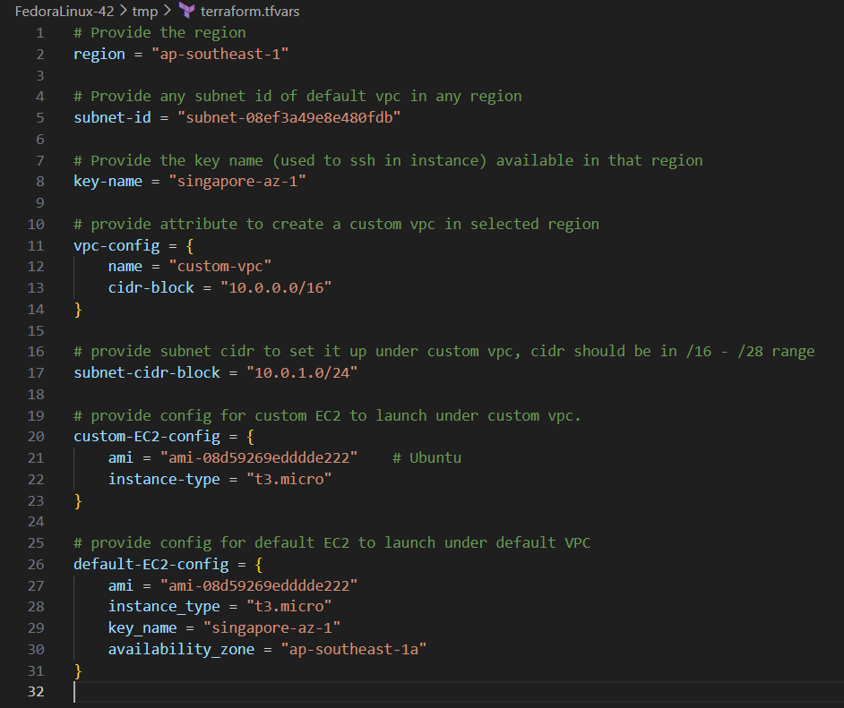
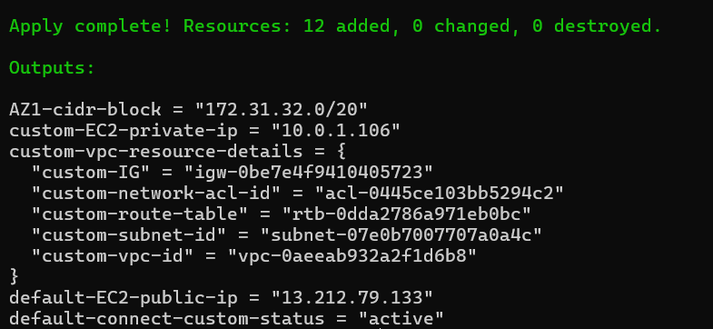
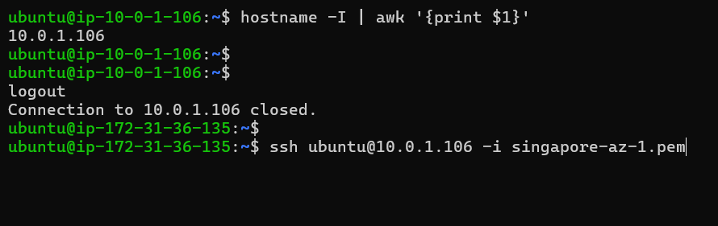
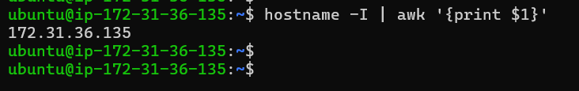
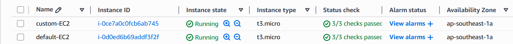

# The motive of project is to create a custom vpc and to achieve a vpc peering in between default vpc and custom vpc of any region.

Install git and terraform
```
sudo yum install git -y
sudo yum install yum-utils -y
sudo yum-config-manager --add-repo https://rpm.releases.hashicorp.com/RHEL/hashicorp.repo
sudo yum install terraform -y
```
Check terraform version and verify
```
terraform --version
terraform -h
```
Install aws cli
```
sudo yum install zip -y
curl "https://awscli.amazonaws.com/awscli-exe-linux-x86_64.zip" -o "awscliv2.zip"
unzip awscliv2.zip
sudo ./aws/install
```

Verify aws cli installation
```
aws --version
```
### Before configuring the aws cli create a user in aws IAM with roles attached to user as per the requirement and also generate the access-key and secret-access-key.

Note i had set-up ap-southeast-1 as a default region at the time of aws configure, choose as per requirement.

Configure aws cli 
```
aws configure
```

Clone the project
```
git clone "https://github.com/MohitGupta1010/VPC-Peering_NACL.git"
cd VPC-Peering_NACL
```
Initiliaze the terraform
```
terraform init
```
Structure and validate the project
```
terraform fmt
terraform validate
terraform plan
```
Execute the Terraform apply command
```
terraform apply -var-file=terraform.tfvars
```
The Terraform file should like these



After Successful apply you'll get an output like below



Take a ssh into default-EC2
```
ssh ubuntu@<public-ip-address-of-default-EC2> -i <key-name>
```

copy the pem key to default-EC2 used to take ssh to custom-EC2
```
scp -i singapore-az-1.pem singapore-az-1.pem ubuntu@<public-ip-address-of-default-EC2>:/home/ubuntu
```

NOW as we can check we are able to ssh into custom-EC2 from default-EC2 only.
```
ssh ubuntu@<private-ip-address-of-custom-EC2> -i <key-name>
```







#### we can only communite to custom-EC2 via default-EC2 and not from internet as nacl is associated to subnet in custom vpc and allow all traffic from default vpc specified availability zone only passed as cidr

#### If required to make custom-EC2 available on internet IG is already attach and route is also defined in custom route-table pointing to IG , just comment out network-acl module in main.tf

## Don't forget to delete the resources
```
terraform destroy --auto-approve
```
